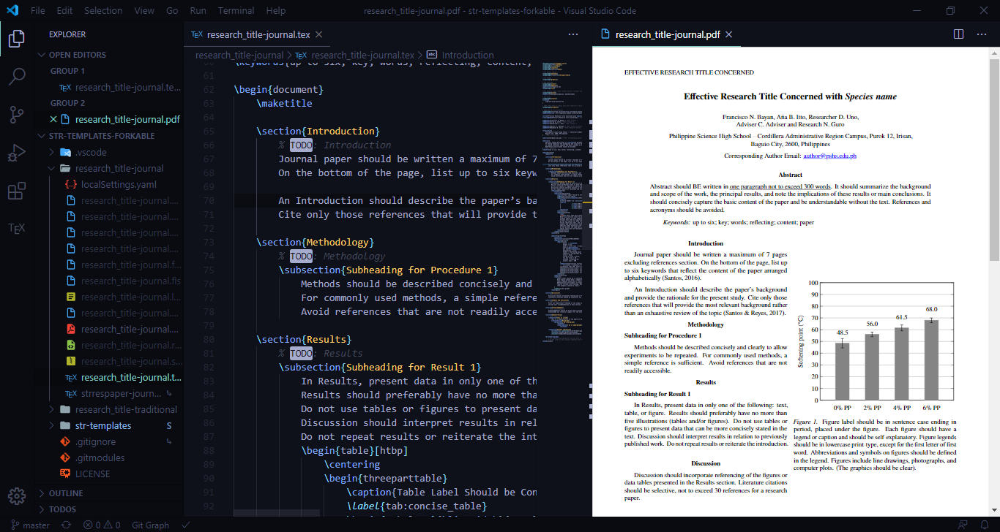
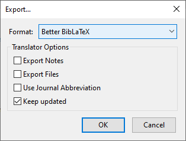
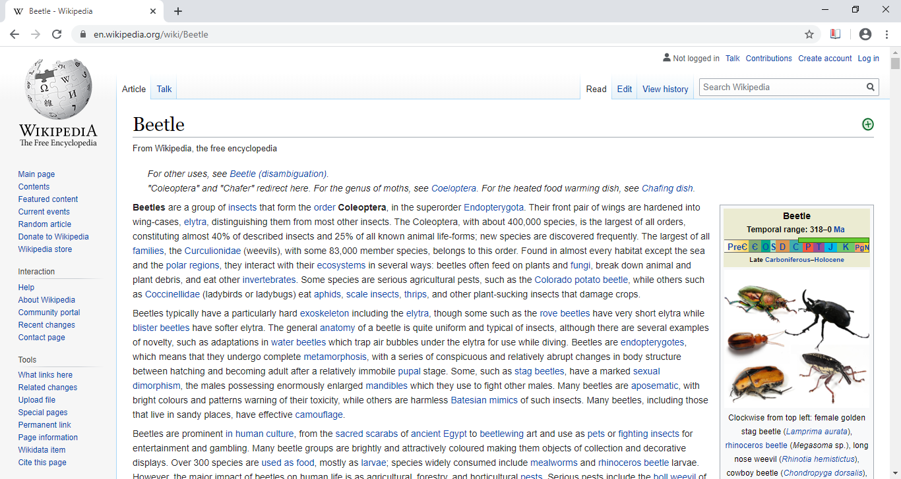
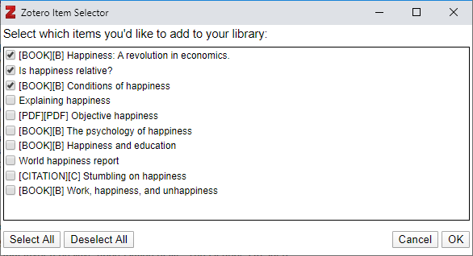

```{r setup, include=FALSE}
knitr::opts_chunk$set(echo = TRUE)
```

Before we start, I just want to thank you personally for participating in our study, and I want to let you know that you may contact me anytime at [vashpatrickancheta@gmail.com](mailto:vashpatrickancheta@gmail.com) or on Messenger.

# Preliminary
The software is listed [here](https://mastertoast10.github.io/research-workflow/installation/).
Make sure to read everything included and install all the software.
You may play around with the software to be accustomed to them if you prefer.
After installing the necessary software, follow the instructions on how to obtain the template files [here](https://mastertoast10.github.io/research-workflow/templates/).

# Testing
You do not need to put actual content in the research papers yet.
To test the research workflow, you must first simulate what happens in the workflow itself.
To do that, this document will guide you into producing a document while walking you through the common features associated with the software.

## New Document
First, you must open the unedited `.tex` document entitled `research_title.tex`.
If you renamed this file according to your research title, open the renamed file instead.
Your workspace will look like the following:



## Making Your `.bib` File
First, open up Zotero and [create a collection](https://www.zotero.org/support/collections_and_tags).
Then, [export this collection to Better BibLaTeX](https://retorque.re/zotero-better-bibtex/exporting/).
Make sure to check the Keep Updated box, as shown here:



Export the `.bib` file to the `research_title-journal` folder, or the folder you renamed it to.

## The Other Sections
You will only edit the Introduction, Results, and Discussion sections in this test.
You should remove the Demonstration section entirely, and replace the text of the other sections with `\fillertext` if you want.
You can also use `\lipsum` to add more paragraphs to the text and see how the document looks like with enough content.

## Editing the Preamble
The preamble is everything in the code before the `\begin{document}`.
The first part you will edit is the species name.
Begin by editing the species name listed as `\newbact{sname}{genus=Species, epithet=name}` and rename it into `\newanimal{Gg}{genus=Goliathus, epithet=goliatus}`.
This means that you declare a new animal with the genus *Goliathus* and epithet *goliatus*, specifying that the animal's species name is *Goliathus goliatus* (The common name is the goliath beetle).

After that, edit this:
```
\sisetup{
	separate-uncertainty=true
}
```
into this:
```
\sisetup{
	separate-uncertainty=true,
	range-phrase=--,
	range-units=single
}
```
`siunitx` is a package that will help you with typesetting units and uncertainties, more on that later.
What you should know however, is that the `range-phrase` and `range-units` values determine how number ranges will be formatted.
You will see this in action when we edit the Introduction.

After that, we edit this section:
```
\usepackage{blindtext} 
```
into this:
```
\usepackage{lipsum}
\newcommand{\fillertext}{\lipsum[1][1-5]}
```
Basically, we will be using the command `\fillertext` to make a single paragraph of filler text for sections that are irrelevant to this test.

Now edit this:
```
\addbibresource{../str-templates/sample-resources/bibliographies/str.bib}
```
to this:
```
\addbibresource{test_document.bib}
```
This is for use in automatic citations and bibliographies.

Now edit this:
```
\title{Effective Research Title Concerned with \bact{sname}} % TODO: Title here
\runningHead{Effective Research Title Concerned} % TODO: 50 characters max for running head
```
to this:
```
\title{Beetle and Beatles: Totally Random Words Concerned with \animal{Gg}}
\runningHead{Beetle and Beatles: Totally Random Words Concerned}
```
By doing this, you change the title of the document, as well as the running header, which is a standard to most journal articles.

After that, rename the first researcher (Student 1) to your full name, in the same format.
And then change the corresponding author email to your own.
This will format your email to be a valid email link with underlines that do not intersect letter descenders such as *g* or *p*.
After that, change the abstract keywords to `beatles; beetles; lorem ipsum`.

You can now save your changes, and LaTeX will automatically update your PDF for you, showing the changes.

## Editing the Introduction
It is now time to edit the Introduction.
Clear out everything listed between the Introduction section and the Methodology section. We will replace it with our own content.

Let us now begin with our first two references, two articles from Wikipedia about Beetles and the Beatles.
**Disclaimer: Wikipedia is often not considered a valid source for formal documents due to its editable nature.**
Go to these links: [Beetle](https://en.wikipedia.org/w/index.php?title=Beetle&oldid=948308773) and [the Beatles](https://en.wikipedia.org/w/index.php?title=The_Beatles&oldid=948129664) and then use the Zotero connector to add the references to the collection we made earlier.
The Zotero connector will appear on the screen when you navigate to a page on Wikipedia as a book icon on the upper right corner, as shown in the following screenshot. Make sure that Zotero is running when you press the icon.



Once you have added the References, they will appear in the Zotero app.
The `.bib` file we have exported earlier will also update automatically.
Now, place the following line after the `\section{Introduction}`:
```
The following excerpts are taken off of \textcite{Beetle2020} and \textcite{Beatles2020}.
```
This makes text citations of both the Beetle and the Beatles pages.
Note that as you type, `\textcite{}`, a suggestion will pop up showing the references currently in your `.bib` file, and when you select a suggestion, the information about each ID will appear.
Next, we add two subsections, titled **Beetles** and **The Beatles** via the `\subsection{}` command.
Your introduction will look like this:
```
\section{Introduction}
	The following excerpts are taken off of \textcite{Beetle2020} and \textcite{Beatles2020}.
	\subsection{Beetles}
	\subsection{The Beatles}
```

After that, add a line beneath the **Beetles** subsection stating that:

> This section talks about beetles.

And then under that, we add this subsection titled *Heaviest Beetle*, with a paragraph titled **The goliath beetle**.
Here we add the line:
```
The heaviest beetle, indeed the heaviest insect stage, is the larva of the goliath beetle, \animal{Gg}, which can attain a mass of at least \SI{115}{\gram} and a length of \SI{11.5}{\centi\meter}.
```
As we can see, we can use `\animal{Gg}` to show the species name of the goliath beetle.
We can also observe the use of the `\SI` commands to append units to 115 and 11.5.

After that, we add a subparagraph titled *Heaviest beetle in its adult stage*, and underneath that we add the line
```
Adult male goliath beetles are the heaviest beetle in its adult stage, weighing \SIrange{70}{100}{\gram} and measuring up to \SI{11}{\centi\meter}.
```
This demonstrates how to add number ranges with units.
As shown in the PDF after you save, the separator is an en-dash, depicted in LaTeX as `--`.
You can change this in `\sisetup` to about any separator you want, which makes document-wide changes convenient, especially if you have a lot of `\SIrange` commands.

Under the *The Beatles* subsection, we add the following line:
```
In The Beatles as Musicians, Walter Everett describes Lennon and McCartney's contrasting motivations and approaches to composition:
```
And then we highlight/select "The Beatles as Musicians" and press <kbd>Ctrl</kbd>+<kbd>L</kbd>+<kbd>I</kbd> to italicize.

After that we use `\enquote{}` to add a quotation, shown in these lines:
```
\enquote{McCartney may be said to have constantly developed---as a means to entertain---a focused musical talent with an ear for counterpoint and other aspects of craft in the demonstration of a universally agreed-upon common language that he did much to enrich.
	Conversely, Lennon's mature music is best appreciated as the daring product of a largely unconscious, searching but undisciplined artistic sensibility.}
```
We can also notice the fact that em-dash is represented as `---`.

In the end, your Introduction will look like this:
```
\section{Introduction}
	The following excerpts are taken off of \textcite{Beetle2020} and \textcite{Beatles2020}.
	\subsection{Beetles}
		This subsection talks about beetles.
		\subsubsection{Heaviest Beetle}
			\paragraph{The goliath beetle}
				The heaviest beetle, indeed the heaviest insect stage, is the larva of the goliath beetle, \animal{Gg}, which can attain a mass of at least \SI{115}{\gram} and a length of \SI{11.5}{\centi\meter}.
				\subparagraph{Heaviest beetle in its adult stage}
					Adult male goliath beetles are the heaviest beetle in its adult stage, weighing \SIrange{70}{100}{\gram} and measuring up to \SI{11}{\centi\meter}.
	\subsection{The Beatles}
		In \textit{The Beatles as Musicians}, Walter Everett describes Lennon and McCartney's contrasting motivations and approaches to composition:
		\enquote{McCartney may be said to have constantly developed---as a means to entertain---a focused musical talent with an ear for counterpoint and other aspects of craft in the demonstration of a universally agreed-upon common language that he did much to enrich.
			Conversely, Lennon's mature music is best appreciated as the daring product of a largely unconscious, searching but undisciplined artistic sensibility.}
```

## Editing the Results
First we clear everything between the Results section and the Discussion section and then add a new subheading titled *Subheading 1*.
We add a `\fillertext` command to add filler content.

After that, we edit the existing table by copying the [data here](https://docs.google.com/spreadsheets/d/1_pplPtoYoTEI7OTQVoU8MtTIbVkNVgCaT04nYAsUrno/edit?usp=sharing), and then pressing <kbd>Ctrl</kbd>+<kbd>Shift</kbd>+<kbd>V</kbd> into the `begin{tabularx}` part and then press <kbd>Alt</kbd>+<kbd>Shift</kbd>+<kbd>F</kbd> to format the document.
We rename the `\begin{tabular}{ccc}` and `\end{tabular}` to `\begin{tabularx}{\linewidth}{XXX}` and `\end{tabularx}` to make the table span the entire width.
We also change the caption to "Fake Data Table `\tnote{a}`" and then the label to "tab:fake_data_table".
Then, we change the table note to:

> Note: This is a table composed of fake data

With this in mind, the final code will look like this:
```
\begin{table}[htbp]
	\centering
	\begin{threeparttable}
		\caption{Fake Data Table \tnote{a}}
		\label{tab:fake_data_table}
		\begin{tabularx}{\linewidth}{XXX}
			\toprule
			Criteria Number & A (\si{\celsius}) & B (\si{\kilo\meter}) \\
			\midrule
			1               & \num{1.00(1)}     & \num{1.00(1)}        \\
			2               & \num{1.00(1)}     & \num{1.00(1)}        \\
			3               & \num{1.00(1)}     & \num{1.00(1)}        \\
			4               & \num{1.00(1)}     & \num{1.00(1)}        \\
			\bottomrule
		\end{tabularx}
		\begin{tablenotes}
			\small
			\item[a] Note: This is a table composed of fake data
		\end{tablenotes}
	\end{threeparttable}
\end{table}
```

After that, we edit the figure by clearing out everything except the `\begin{figure}/\end{figure}`, `\centering`, `\caption`, and `\label` commands.
We save the following photo that is hosted on Unsplash into the `research_title` folder:

After that, we put an `\includegraphics{}` command in between `\centering` and `\caption`, and a suggestion will appear showing the image file.
Simply press <kbd>Enter</kbd> and the file name is typed in.
Change the caption to "Photo of a lens" and the label to "fig:lens_photo".
Your figure will look like this:
```
\begin{figure}[htbp]
	\centering
	\includegraphics[width=\linewidth]{bernard-hermant-IhcSHrZXFs4-unsplash.jpg}
	\caption{Photo of a lens}
	\label{fig:lens_photo}
```

At the end of the section, your Results section will look like this:
```
\section{Results}
	\subsection{Subheading 1}
		\fillertext
		\begin{table}[htbp]
			\centering
			\begin{threeparttable}
				\caption{Fake Data Table \tnote{a}}
				\label{tab:fake_data_table}
				\begin{tabularx}{\linewidth}{XXX}
					\toprule
					Criteria Number & A (\si{\celsius}) & B (\si{\kilo\meter}) \\
					\midrule
					1               & \num{1.00(1)}     & \num{1.00(1)}        \\
					2               & \num{1.00(1)}     & \num{1.00(1)}        \\
					3               & \num{1.00(1)}     & \num{1.00(1)}        \\
					4               & \num{1.00(1)}     & \num{1.00(1)}        \\
					\bottomrule
				\end{tabularx}
				\begin{tablenotes}
					\small
					\item[a] Note: This is a table composed of fake data
				\end{tablenotes}
			\end{threeparttable}
		\end{table}

		\begin{figure}[htbp]
			\centering
			\includegraphics[width=\linewidth]{bernard-hermant-IhcSHrZXFs4-unsplash.jpg}
			\caption{Photo of a lens}
			\label{fig:lens_photo}
		\end{figure}
```

## Editing the Discussion
Clear out everything between Discussion and Summary and Conclusion.
Let's make two subsections: **References to Illustrations** and **Bibliographic References**.
Under **References to Illustrations**, write the following lines:
```
This sentence uses Figure~\ref{fig:lens_photo} as a reference.
This other sentence talks about Table~\ref{tab:fake_data_table}.
You can also refer to other illustrations with their own labels.
```
As you can see when you save the document, the Figure and Table numbers are automatically placed, and you can click on the numbers to go directly to the referred Figures and Tables.

Let us look through the other ways you can add references to Zotero.
Using the [identifier method](https://www.zotero.org/support/adding_items_to_zotero#add_item_by_identifier), add the Literature with the DOI `10.1037/pspp0000185` to your collection.
Using the [PDF metadata method](https://www.zotero.org/support/retrieve_pdf_metadata), add the Literature on [this PDF](https://www.ncbi.nlm.nih.gov/pmc/articles/PMC7085855/pdf/per-43-48.pdf) to your collection.
Do note that you need to download the PDF to use the metadata method.
You can also go to [Google Scholar](https://scholar.google.com/) and search up "happiness", and then add the first three most relevant items of all time using the Zotero browser extension, as shown here:



To utilize the references we just collected, under **Bibliographic References**, write the following lines:
```
The following sentence makes a fake text citation:
\textcite{maryaniNewEndemicFusarium2019} discusses new endemic species.
The following sentences show a fake parenthesized citation:
How you behave in school predicts your success in the future \autocite{spenglerHowYouBehave2018}.
\textcite{freyHappinessRevolutionEconomics2008}, \textcite{veenhovenConditionsHappiness2013}, and \textcite{veenhovenHappinessRelative1991} state the importance of happiness.
```
As you can see, we can use `\textcite` to make text citations and `\autocite` to make parenthesized citations.
Once you cite a reference in your collection once, the bibliographic data will be added to the references.

At the end of this section, your Discussion section will look like this:
```
\section{Discussion}
	\subsection{References to Illustrations}
		This sentence uses Figure~\ref{fig:lens_photo} as a reference.
		This other sentence talks about Table~\ref{tab:fake_data_table}.
		You can also refer to other illustrations with their own labels.
	\subsection{Bibliographic References}
		The following sentence makes a fake text citation:
		\textcite{maryaniNewEndemicFusarium2019} discusses new endemic species.
		The following sentences show a fake parenthesized citation:
		How you behave in school predicts your success in the future \autocite{spenglerHowYouBehave2018}.
		\textcite{freyHappinessRevolutionEconomics2008}, \textcite{veenhovenConditionsHappiness2013}, and \textcite{veenhovenHappinessRelative1991} state the importance of happiness.
```

## Commit and Push
After finishing your test document, you may remove the `% TODO` comments.
Your test document will look like this:
```
\documentclass{strrespaper-journ}
\usepackage[utf8]{inputenc}
\usepackage[T1]{fontenc}
\usepackage{csquotes}
\usepackage[english]{babel}

% For better tables
\usepackage{booktabs}
\usepackage[flushleft]{threeparttable}

% For images
\usepackage{graphicx}

% For plotting
\usepackage{xcolor}
\usepackage{pgfplots}
\pgfplotsset{compat=1.16}
\usepackage{tikz}

% For species names (type "texdoc biocon" [without the quotes] for more information)
\usepackage{biocon}
\newanimal{Gg}{genus=Goliathus, epithet=goliatus}

% For units
\usepackage{siunitx}
\sisetup{
	separate-uncertainty=true,
	range-phrase=--,
	range-units=single
}

\usepackage{lipsum}
\newcommand{\fillertext}{\lipsum[1][1-5]}

% Required for the citations
\usepackage[style=apa,sortcites=true,sorting=nyt,backend=biber]{biblatex}
\addbibresource{test_document.bib}

\title{Beetle and Beatles: Totally Random Words Concerned with \animal{Gg}}
\runningHead{Beetle and Beatles: Totally Random Words Concerned}

\addAuthor{Vash Patrick B. Ancheta}
\addAuthor{Francisco N. Bayan}
\addAuthor{A\~na B. Itto}

\addAuthor{Adviser C. Adviser}
\addAuthor{Research N. Guro}

\affiliation{
	Philippine Science High School -- Cordillera Administrative Region Campus, Purok 12, Irisan,\\
	Baguio City, 2600, Philippines
}

\email{vashpatrickancheta@gmail.com}

\abstract{
	Abstract should BE written in \ctuline{one paragraph not to exceed 300 words}.
	It should summarize the background and scope of the work, the principal results, and note the implications of these results or main conclusions.
	It should concisely capture the basic content of the paper and be understandable without the text.
	References and acronyms should be avoided.
}
\keywords{beatles; beetles; lorem ipsum}

\begin{document}
	\maketitle

	\section{Introduction}
		The following excerpts are taken off of \textcite{Beetle2020} and \textcite{Beatles2020}.
		\subsection{Beetles}
			This subsection talks about beetles.
			\subsubsection{Heaviest Beetle}
				\paragraph{The goliath beetle}
					The heaviest beetle, indeed the heaviest insect stage, is the larva of the goliath beetle, \animal{Gg}, which can attain a mass of at least \SI{115}{\gram} and a length of \SI{11.5}{\centi\meter}.
					\subparagraph{Heaviest beetle in its adult stage}
						Adult male goliath beetles are the heaviest beetle in its adult stage, weighing \SIrange{70}{100}{\gram} and measuring up to \SI{11}{\centi\meter}.
		\subsection{The Beatles}
			In \textit{The Beatles as Musicians}, Walter Everett describes Lennon and McCartney's contrasting motivations and approaches to composition:
			\enquote{McCartney may be said to have constantly developed---as a means to entertain---a focused musical talent with an ear for counterpoint and other aspects of craft in the demonstration of a universally agreed-upon common language that he did much to enrich.
				Conversely, Lennon's mature music is best appreciated as the daring product of a largely unconscious, searching but undisciplined artistic sensibility.}

	\section{Methodology}
		\subsection{Subheading 1}
			\fillertext

	\section{Results}
		\subsection{Subheading 1}
			\fillertext
			\begin{table}[htbp]
				\centering
				\begin{threeparttable}
					\caption{Fake Data Table \tnote{a}}
					\label{tab:fake_data_table}
					\begin{tabularx}{\linewidth}{XXX}
						\toprule
						Criteria Number & A (\si{\celsius}) & B (\si{\kilo\meter}) \\
						\midrule
						1               & \num{1.00(1)}     & \num{1.00(1)}        \\
						2               & \num{1.00(1)}     & \num{1.00(1)}        \\
						3               & \num{1.00(1)}     & \num{1.00(1)}        \\
						4               & \num{1.00(1)}     & \num{1.00(1)}        \\
						\bottomrule
					\end{tabularx}
					\begin{tablenotes}
						\small
						\item[a] Note: This is a table composed of fake data
					\end{tablenotes}
				\end{threeparttable}
			\end{table}

			\begin{figure}[htbp]
				\centering
				\includegraphics[width=\linewidth]{bernard-hermant-IhcSHrZXFs4-unsplash.jpg}
				\caption{Photo of a lens}
				\label{fig:lens_photo}
			\end{figure}

	\section{Discussion}
		\subsection{References to Illustrations}
			This sentence uses Figure~\ref{fig:lens_photo} as a reference.
			This other sentence talks about Table~\ref{tab:fake_data_table}.
			You can also refer to other illustrations with their own labels.
		\subsection{Bibliographic References}
			The following sentence makes a fake text citation:
			\textcite{maryaniNewEndemicFusarium2019} discusses new endemic species.
			The following sentences show a fake parenthesized citation:
			How you behave in school predicts your success in the future \autocite{spenglerHowYouBehave2018}.
			\textcite{freyHappinessRevolutionEconomics2008}, \textcite{veenhovenConditionsHappiness2013}, and \textcite{veenhovenHappinessRelative1991} state the importance of happiness.

	\section{Summary and Conclusion}
		\fillertext

	\section{Acknowledgement}
		\fillertext

	\printbibliography
\end{document}
```
If you want to save your changes and upload them to the Internet for safekeeping, you may now commit and push the same way you did when you followed the instructions at [the site](https://mastertoast10.github.io/research-workflow/templates/#first-commit-and-push).

# Rating
Use [this form](https://forms.office.com/Pages/ResponsePage.aspx?id=DQSIkWdsW0yxEjajBLZtrQAAAAAAAAAAAAO__c2RBKtUQkxXTzVUWjFWN09aQkFaUFJGTU9YRTFXRS4u) to rate your experience with the workflow.
Thank you for trying out this workflow.